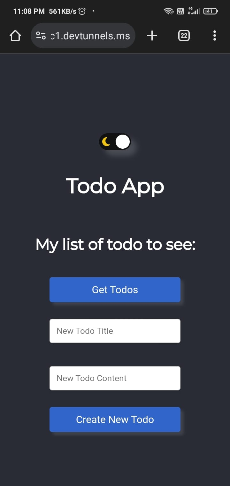

# Todo-List-with-Reactjs-Rust

# Project Details

## Overview
This project is a Todo List application built with React.js for the frontend and Rust for the backend.

## Frontend
The frontend of the application is located in the [todo-app](todo-app/) directory. It was bootstrapped with [Create React App](https://github.com/facebook/create-react-app). The main application code can be found in [todo-app/src/App.js](todo-app/src/App.js).

## Backend
The backend of the application is located in the [todo_simple_api_rocket](todo_todo_simple_api_rocket) directory. It uses the Rocket framework for Rust. The main server code can be found in [todo_simple_api_rocket/src/main.rs](todo_todo_simple_api_rocket/src/main.rs).

## Running the Project
To run the frontend of the application, navigate to the `todo-app` directory and run `npm start`. To build the frontend for production, run `npm run build`.

To run the backend of the application, navigate to the `todo_simple_api_rocket` directory and use the command `cargo run`.

## API Endpoints
The backend server provides the following API endpoints:

- `GET /api/todos`: Fetches the list of todos.
- `POST /api/todos`: Creates a new todo.
- `PUT /api/todos/:id`: Updates a specific todo.
- `DELETE /api/todos/:id`: Deletes a specific todo.

## Light/Dark Mode Support
This project supports light and dark modes for a better user experience. The mode can be toggled within the application settings.

## Screenshots
### Desktop

### Mobile

        &nbsp; &nbsp; &nbsp; &nbsp;                   
  

## Contributing
Contributions are welcome! Please read the [contributing guide](CONTRIBUTING.md) for more information.

## License
This project is licensed under the [MIT License](LICENSE.md).
